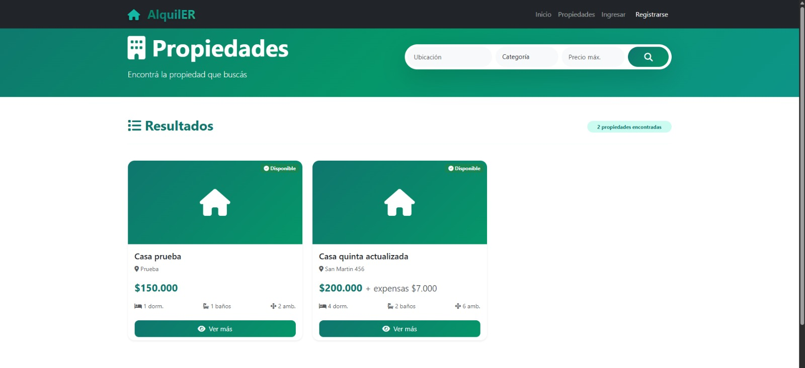

# Documento Técnico — Sistema AlquilER

## 1. Descripción General del Sistema

### Nombre del sistema
**AlquilER** — Sistema de gestión y alquiler de propiedades

### Tecnologías utilizadas
El sistema está desarrollado utilizando una arquitectura de API REST y las siguientes tecnologías principales:

* **PHP** como lenguaje de programación del backend.
* **MySQL** como sistema gestor de base de datos.
* **Eloquent ORM** mediante `illuminate/database` para el acceso y manejo de datos.
* **Composer** para la gestión de dependencias.
* **JWT (JSON Web Token)** mediante `firebase/php-jwt` para la autenticación.
* **PHP dotenv** para la gestión segura de variables de entorno.
* **Swagger/OpenAPI** mediante `swagger-php` para la documentación de la API.
* **Apache/XAMPP** como entorno de desarrollo local.

### Propósito general
El sistema AlquilER tiene como objetivo gestionar el alquiler de propiedades, permitiendo centralizar la información relacionada con propiedades, usuarios, reservas, consultas, servicios y demás elementos asociados al proceso de alquiler. 

El backend se desarrolla como una API REST, permitiendo que posteriormente pueda ser consumido por diferentes clientes, como una aplicación web y una aplicación móvil, manteniendo separada la lógica del servidor de las interfaces de usuario.

### Módulos principales
La API se encuentra organizada alrededor de las siguientes entidades principales:

* **Autenticador:** registro, inicio y cierre de sesión mediante JWT.
* **Usuarios:** gestión de los usuarios del sistema y sus roles.
* **Propiedades:** administración y consulta de las propiedades disponibles.
* **Imágenes:** gestión de las imágenes asociadas a las propiedades.
* **Categorías:** clasificación de las propiedades.
* **Provincias y localidades:** organización geográfica de las propiedades.
* **Roles:** definición de los permisos y tipos de usuario.
* **Favoritos:** permite a los usuarios guardar propiedades de interés.
* **Consultas:** gestión de consultas realizadas sobre propiedades.
* **Reservas:** administración del proceso de reserva de propiedades.
* **Reseñas:** valoración y comentarios sobre propiedades.
* **Servicios:** servicios disponibles para las propiedades.
* **Propiedad-Servicios:** relación entre propiedades y servicios.
* **Log de actividad:** registro de determinadas acciones realizadas en el sistema.

> La API utiliza respuestas JSON estandarizadas y maneja códigos HTTP según el resultado de cada operación.

### Interfaz del sistema
**Captura de pantalla de la interfaz:**

 

---

## 2. Mapa de Componentes

La estructura del backend se organiza mediante diferentes capas y responsabilidades. El objetivo es evitar que una misma clase concentre responsabilidades pertenecientes a distintas capas.

| Archivo / Componente | Capa identificada |
| :--- | :--- |
| `public/index.php` | Entrada / API |
| `src/routes/api.php` | Routing |
| `src/routes/Router.php` | Routing |
| `src/controllers/Api/` | BLL / Controladores |
| `src/Models/` | DAL / Acceso y representación de datos |
| `src/validators/` | BLL / Validación |
| `src/sanitizers/` | BLL / Sanitización |
| `src/middlewares/` | Autenticación / Autorización |
| `src/helpers/Response.php` | API / Respuestas HTTP |
| `src/helpers/JwtHelper.php` | Autenticación |
| `src/database.php` | DAL / Configuración de acceso a datos |
| `config/config.php` | Configuración |
| `.env` | Configuración de entorno |
| `src/debug/` | Soporte / Desarrollo |

### Organización general
El flujo principal de una petición puede representarse de la siguiente manera:

`Cliente` → `public/index.php` → `Router` → `Middleware` → `Controller` → `Model/BD` → `Response`

De esta manera, cada componente tiene una responsabilidad definida dentro del procesamiento de las solicitudes.

---

## 3. Problemas de Diseño Detectados

Durante el análisis inicial del sistema se detectaron diferentes situaciones en las que existía una mezcla de responsabilidades. Estos problemas constituyen puntos de partida para las refactorizaciones posteriores.

### 3.1. Controladores con exceso de responsabilidades
* **Archivo:** `src/controllers/Api/`
* **Problema:** Algunos controladores concentran diferentes tareas dentro de una misma clase, como recepción de datos, validación, sanitización, aplicación de reglas de negocio, acceso a modelos y construcción de respuestas HTTP. Esto dificulta el mantenimiento y hace que los controladores dependan de demasiados componentes.
* **Propuesta preliminar:** Separar progresivamente las responsabilidades, dejando en los controladores principalmente la coordinación de la petición y delegando la validación, sanitización y lógica específica a sus respectivos componentes.

### 3.2. Acceso a datos y lógica de negocio demasiado acoplados
* **Archivos:** `src/controllers/Api/` y `src/Models/`
* **Problema:** Parte de la lógica necesaria para realizar determinadas operaciones puede quedar directamente relacionada con la forma en que se consulta o modifica la base de datos. Esto genera un acoplamiento entre la lógica de negocio y la persistencia.
* **Propuesta preliminar:** Centralizar progresivamente las operaciones relacionadas con la persistencia y las relaciones entre entidades, evitando que los controladores tengan que conocer detalles innecesarios de la base de datos. De esta forma se busca una separación más clara entre BLL y DAL.

### 3.3. Responsabilidades relacionadas con autenticación distribuidas
* **Archivos:** `src/middlewares/`, `src/helpers/JwtHelper.php` y controladores relacionados con autenticación.
* **Problema:** La autenticación requiere diferentes tareas: generación y validación de tokens, extracción del token de la petición, comprobación de permisos y aplicación de restricciones según el rol. Si estas responsabilidades se mezclan con la lógica propia de los controladores, aumenta el acoplamiento y se dificulta reutilizar los mecanismos de seguridad.
* **Propuesta preliminar:** Mantener la generación y validación de JWT dentro de los componentes de autenticación y utilizar middleware para controlar el acceso a los endpoints protegidos, dejando a los controladores únicamente la lógica correspondiente a la operación solicitada.

### 3.4. Construcción de respuestas HTTP dentro de la lógica de las operaciones
* **Archivo:** `src/helpers/Response.php` y controladores.
* **Problema:** La API necesita mantener una estructura uniforme para las respuestas exitosas y los errores. Si cada controlador construye manualmente las respuestas, pueden aparecer diferencias en nombres de campos, códigos HTTP y estructuras JSON.
* **Propuesta preliminar:** Centralizar la construcción de respuestas HTTP mediante el helper `Response`, manteniendo una estructura uniforme para respuestas exitosas, errores de validación, autenticación, autorización, recursos inexistentes y conflictos.

---

## 4. Plan Preliminar de Mejora

El proceso de mejora priorizará inicialmente la consolidación de la arquitectura y la separación de responsabilidades:

1. **Integrantes:** Fernandez Mariano, Pretz Julian.
2. **Roles asignados:** Fernandez Mariano: Teach lead, dev backend. Pretz Julian: deb frontend, QA / Documentador.
3. **Dominio:** Gestión inmobiliaria y alquiler de propiedades. Entidades principales: Propiedad, Usuario, Reserva, Categoria y Servicio.

---

## 5. Plan Preliminar de Mejora

El proceso de mejora priorizará inicialmente la consolidación de la arquitectura y la separación de responsabilidades:

1. **Revisión de base de datos:** En primer lugar se verificará la estructura de la base de datos, sus relaciones y restricciones de integridad.
2. **Revisión de flujo:** Posteriormente se revisará el flujo general de la API y la separación entre routing, autenticación, controladores, validación y acceso a datos.
3. **Refactorización:** Luego se refactorizarán los componentes que presenten mayor acoplamiento o mezcla de responsabilidades.
4. **Estandarización:** Finalmente se revisará el manejo uniforme de respuestas, errores, seguridad y consultas a la base de datos. 

El objetivo es obtener una API REST más mantenible, segura, escalable y preparada para ser consumida por diferentes clientes.

## Evidencia de pruebas

[GET-PROPIEDADES](./docs/capturas/get-propiedades.png)
[POST-LOGIN](./docs/capturas/post-login.png)
[POST-PROPIEDADES-1](./docs/capturas/post-propiedades-1.png)
[POST-PROPIEDADES-2](./docs/capturas/post-propiedades-2.png)
[PUT-PROPIEDADES](./docs/capturas/put-propiedades-1.png)

